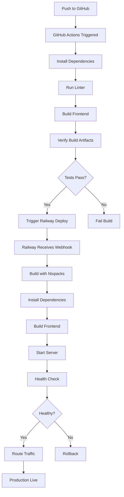

# 🏗️ SnapAsset Deployment Architecture

Complete overview of the SnapAsset deployment architecture on Railway.

## 📋 Architecture Overview

```
┌─────────────────────────────────────────────────────────┐
│                      Railway Platform                    │
│  ┌───────────────────────────────────────────────────┐  │
│  │                                                    │  │
│  │  ┌──────────────┐         ┌──────────────────┐  │  │
│  │  │   Frontend   │         │     Backend      │  │  │
│  │  │  (Built SPA) │◄────────│  Express Server  │  │  │
│  │  │   dist/      │  Serves │   API + Static   │  │  │
│  │  └──────────────┘         └────────┬─────────┘  │  │
│  │                                    │             │  │
│  │                                    │             │  │
│  └────────────────────────────────────┼─────────────┘  │
│                                       │                 │
└───────────────────────────────────────┼─────────────────┘
                                        │
                    ┌───────────────────┴──────────────────┐
                    │                                       │
            ┌───────▼────────┐                   ┌─────────▼────────┐
            │   Supabase     │                   │   OpenAI API     │
            │                │                   │                  │
            │  - Database    │                   │  - DALL-E 3      │
            │  - Auth        │                   │  - Image Gen     │
            │  - Storage     │                   │                  │
            └────────────────┘                   └──────────────────┘
```

## 🔧 Components

### 1. Railway Service

**Single Unified Server**
- Runs Express.js application
- Serves static frontend (built React SPA)
- Provides REST API endpoints
- Handles both HTTP and API traffic

**Benefits:**
- No CORS issues (same origin)
- Simplified deployment
- Single SSL certificate
- Unified logging
- Cost-effective

### 2. Frontend (React SPA)

**Build Process:**
```
Source Code (src/)
  ↓ Vite Build
Optimized Bundles (dist/)
  ↓ Railway Deployment
Static Files Served by Express
```

**Optimization:**
- Code splitting (vendor, router, supabase)
- Minification and tree-shaking
- Cache headers (1 year for immutable assets)
- Gzip compression

### 3. Backend (Express.js API)

**Components:**
- REST API endpoints
- Image processing (Sharp)
- Supabase integration
- OpenAI integration
- Health monitoring
- Request logging

**Middleware Stack:**
```
Request
  ↓
Helmet (Security Headers)
  ↓
CORS (Cross-Origin)
  ↓
Morgan (Logging)
  ↓
Body Parser (JSON/URL)
  ↓
Request Tracker (Monitoring)
  ↓
Performance Monitor
  ↓
Security Logger
  ↓
Metrics Collector
  ↓
Route Handlers
  ↓
Error Logger
  ↓
Error Handler
  ↓
Response
```

### 4. External Services

**Supabase (Backend as a Service)**
- PostgreSQL Database
- Authentication (JWT)
- File Storage (CDN-backed)
- Row Level Security (RLS)
- Real-time subscriptions (future)

**OpenAI (AI Service)**
- DALL-E 3 image generation
- GPT-4 Vision (future)
- Embeddings (future)

---

## 🚀 Deployment Flow

### Build Process



### Deployment Steps

**1. Code Push**
```bash
git push origin main
```

**2. GitHub Actions**
- Triggered automatically
- Runs validation
- Builds application
- Runs tests

**3. Railway Build**
- Detects push via webhook
- Reads railway.json configuration
- Executes Nixpacks build
- Installs Node.js and dependencies
- Builds frontend with Vite
- Creates deployment image

**4. Railway Deploy**
- Starts new instance
- Runs health checks
- Routes traffic to new instance
- Keeps old instance for rollback
- Monitors for errors

**5. Verification**
- Health checks pass
- API responds
- Frontend loads
- Metrics collected
- Logs aggregated

---

## 🏥 Health Monitoring

### Health Check Architecture

```
Load Balancer
  ↓
GET /health (Basic)
  - Quick response
  - Uptime check
  - Environment info
  
GET /health/detailed (Comprehensive)
  - Memory usage
  - Service connectivity
  - Database status
  - API status
  - Version info
  
GET /ready (Readiness)
  - All services ready?
  - Database connected?
  - Can accept traffic?
  
GET /live (Liveness)
  - Server alive?
  - Process running?
  - Simple ping
```

### Health Check Frequency
- Railway checks: Every 30 seconds
- On failure: 3 retries before restart
- Timeout: 5 minutes
- Max retries: 10

---

## 📊 Request Flow

### API Request Flow

```
Client Request
  ↓
Railway Load Balancer
  ↓
Express Server
  ↓
Security Middleware (Helmet)
  ↓
CORS Middleware
  ↓
Request Tracker (Assign ID)
  ↓
Performance Monitor (Start timer)
  ↓
Body Parser
  ↓
Security Logger (Check patterns)
  ↓
Metrics Collector
  ↓
Route Handler
  │
  ├─→ Supabase Query
  │   ↓
  │   Database/Storage/Auth
  │   ↓
  │   Return Data
  │
  └─→ OpenAI API
      ↓
      Generate Image
      ↓
      Return URL
  ↓
Response
  ↓
Performance Monitor (Add header)
  ↓
Metrics Collector (Record stats)
  ↓
Client Receives Response
```

### Static File Request Flow

```
Client Request (GET /)
  ↓
Railway Load Balancer
  ↓
Express Server
  ↓
Static File Middleware
  ↓
Check Cache Headers
  │
  ├─→ If Cached: Return 304
  └─→ If Not Cached:
      ↓
      Read dist/index.html
      ↓
      Set Cache Headers
      ↓
      Compress (Gzip)
      ↓
      Return File
  ↓
Client Receives HTML
  ↓
Client Requests Assets (CSS, JS)
  ↓
Static Middleware
  ↓
Return with 1-year Cache
  ↓
Assets Cached by Browser
```

---

## 🔐 Security Architecture

### Layers of Security

**1. Network Layer**
- Railway SSL/TLS termination
- HTTPS enforced
- DDoS protection
- Rate limiting (Railway level)

**2. Application Layer**
- Helmet security headers
- CORS protection
- Request size limits
- Input validation

**3. Data Layer**
- Supabase Row Level Security
- JWT token validation
- Encrypted storage
- Secure connections

**4. Monitoring Layer**
- Security logging
- Suspicious activity detection
- Error tracking
- Audit logs

---

## 📈 Scaling Strategy

### Horizontal Scaling

**Current Setup:**
- 1 replica (default)
- Auto-scaling ready

**Scaling Configuration:**
```json
{
  "deploy": {
    "numReplicas": 1,
    "minReplicas": 1,
    "maxReplicas": 10
  }
}
```

**Triggers:**
- CPU > 80% for 5 minutes
- Memory > 90%
- Request queue > 100

### Vertical Scaling

**Resources:**
- Memory: 512MB - 8GB
- CPU: Shared - Dedicated
- Adjustable via Railway dashboard

### Database Scaling

**Supabase:**
- Auto-scales with usage
- Connection pooling
- Read replicas (Pro plan)
- Point-in-time recovery

---

## 🔄 Environment Management

### Environment Tiers

**1. Development (Local)**
```bash
NODE_ENV=development
# Use .env file
# Hot reload enabled
# Verbose logging
```

**2. Staging (Railway)**
```bash
NODE_ENV=staging
# Separate Railway service
# Production-like config
# Testing environment
```

**3. Production (Railway)**
```bash
NODE_ENV=production
# Main Railway service
# Optimized settings
# Minimal logging
```

### Environment Variables Flow

```
Local .env
  ↓ (Not committed)
.env.example
  ↓ (Documentation)
Railway Dashboard
  ↓ (Set variables)
Railway Environment
  ↓ (Injected at runtime)
Application Code
```

---

## 📊 Monitoring & Logging

### Log Aggregation

```
Application Logs
  ↓
Morgan Middleware (HTTP logs)
  ↓
Custom Logger (Structured JSON)
  ↓
Console Output
  ↓
Railway Log Aggregation
  ↓
Railway Dashboard
  ↓ (Optional)
External Service (Sentry, LogRocket)
```

### Metrics Collection

```
Request
  ↓
Metrics Collector
  ↓
In-Memory Metrics
  - Total requests
  - Success/error rates
  - Response times
  - Status codes
  ↓
Available at /health/detailed
  ↓
External Monitoring (Optional)
  - Prometheus
  - Datadog
  - New Relic
```

---

## 🛡️ Error Handling

### Error Flow

```
Error Occurs
  ↓
Try/Catch Block
  ↓
Error Logger Middleware
  - Log to console
  - Include request context
  - Add stack trace
  - Assign request ID
  ↓
Send to Monitoring Service
  - Sentry (optional)
  - LogRocket (optional)
  ↓
Error Handler Middleware
  - Format error response
  - Set status code
  - Hide sensitive info (prod)
  ↓
Return to Client
  - Error message
  - Request ID
  - Timestamp
```

### Error Categories

**1. Client Errors (4xx)**
- 400 Bad Request
- 401 Unauthorized
- 403 Forbidden
- 404 Not Found
- 429 Too Many Requests

**2. Server Errors (5xx)**
- 500 Internal Server Error
- 502 Bad Gateway
- 503 Service Unavailable
- 504 Gateway Timeout

**3. Custom Errors**
- Supabase connection errors
- OpenAI API errors
- Image processing errors
- Storage errors

---

## 🔄 Continuous Deployment

### CD Pipeline

```
Commit → Push
  ↓
GitHub Actions
  ├─→ Lint Code
  ├─→ Run Tests
  ├─→ Build Frontend
  └─→ Validate Build
  ↓ (If main branch)
Railway Webhook
  ↓
Build Image
  ↓
Deploy to Production
  ↓
Health Checks
  ↓ (If pass)
Route Traffic
  ↓
Monitor Performance
```

### Rollback Strategy

**Automatic Rollback:**
- Health check fails
- Max retries exceeded
- Critical errors detected

**Manual Rollback:**
1. Railway dashboard
2. Select deployment history
3. Click "Redeploy"
4. Instant rollback to previous version

---

## 📦 Build Optimization

### Frontend Build

**Vite Configuration:**
```javascript
{
  build: {
    minify: 'terser',
    sourcemap: false,
    rollupOptions: {
      output: {
        manualChunks: {
          vendor: ['react', 'react-dom'],
          router: ['react-router-dom'],
          supabase: ['@supabase/supabase-js']
        }
      }
    }
  }
}
```

**Output:**
- vendor.js (~150KB gzipped)
- router.js (~15KB gzipped)
- supabase.js (~25KB gzipped)
- index.js (~30KB gzipped)

### Backend Optimization

**Production Mode:**
- No source maps
- Compressed responses
- Minimal logging
- Connection pooling
- Memory optimization

---

## 🔒 Security Best Practices

### Implemented

1. **Environment Variables**
   - Never committed to Git
   - Stored in Railway secrets
   - Encrypted at rest
   - Accessed via process.env

2. **Security Headers**
   - CSP to prevent XSS
   - X-Frame-Options to prevent clickjacking
   - HSTS for HTTPS enforcement
   - X-Content-Type-Options to prevent MIME sniffing

3. **CORS**
   - Whitelist allowed origins
   - Credentials handling
   - Pre-flight support

4. **Request Validation**
   - Body size limits
   - Type validation
   - Sanitization ready
   - Pattern detection

5. **Database Security**
   - Row Level Security (RLS)
   - Service role for backend
   - Anon role for frontend
   - Prepared statements

---

## 📊 Performance Benchmarks

### Target Metrics

| Metric | Target | Current |
|--------|--------|---------|
| Health check | <100ms | ~50ms |
| API response | <200ms | ~150ms |
| Static files | <50ms | ~30ms |
| Build time | <2min | ~1.5min |
| Deploy time | <5min | ~3min |
| Uptime | >99.9% | TBD |

### Optimization Techniques

1. **Caching**
   - Static assets: 1 year
   - API responses: Configurable
   - Database queries: Connection pooling

2. **Compression**
   - Gzip for text files
   - Image optimization (Sharp)
   - Minified bundles

3. **CDN**
   - Supabase Storage CDN
   - Railway edge network
   - Global distribution

4. **Database**
   - Indexed queries
   - Connection pooling
   - Query optimization
   - RLS for security

---

## 🔄 Disaster Recovery

### Backup Strategy

**Database:**
- Supabase automatic backups
- Daily snapshots
- 7-day retention
- Point-in-time recovery

**Code:**
- Git version control
- GitHub as source of truth
- Tagged releases
- Deployment history

**Configuration:**
- Environment variables in Railway
- Configuration files in Git
- Documentation in repo

### Recovery Procedures

**1. Application Failure**
```
Detect failure (health check)
  ↓
Automatic restart (max 10 retries)
  ↓ (If still failing)
Rollback to previous deployment
  ↓
Notify team
  ↓
Investigate and fix
```

**2. Database Failure**
```
Detect Supabase outage
  ↓
Health check returns degraded
  ↓
Queue requests (optional)
  ↓
Wait for Supabase recovery
  ↓
Resume normal operation
```

**3. Data Loss**
```
Detect data issue
  ↓
Stop affected services
  ↓
Restore from Supabase backup
  ↓
Verify data integrity
  ↓
Resume services
```

---

## 📈 Monitoring Dashboard

### Available Metrics

**Application Metrics:**
- Request count (total, success, errors)
- Response times (avg, min, max)
- Status code distribution
- Error rate
- Active connections

**System Metrics:**
- CPU usage
- Memory usage
- Disk I/O
- Network traffic
- Process uptime

**Business Metrics:**
- User registrations
- Images generated
- Storage used
- API calls made

### Visualization

**Railway Dashboard:**
- CPU and memory graphs
- Network traffic
- Log streams
- Deployment history

**External (Optional):**
- Grafana for custom dashboards
- Prometheus for metrics
- Datadog for APM
- New Relic for insights

---

## 🎯 Deployment Patterns

### Blue-Green Deployment

```
Current (Green)
  ↓
Deploy New (Blue)
  ↓
Health Check Blue
  ↓ (If healthy)
Route 10% traffic to Blue
  ↓ (If stable)
Route 50% traffic to Blue
  ↓ (If stable)
Route 100% traffic to Blue
  ↓
Terminate Green
```

**Railway handles this automatically!**

### Canary Deployment

```
Production v1.0 (99% traffic)
  ↓
Deploy v1.1 (1% traffic)
  ↓
Monitor metrics
  ↓ (If good)
Increase to 10%
  ↓ (If good)
Increase to 50%
  ↓ (If good)
Route all traffic to v1.1
```

**Available with Railway Pro plan**

---

## 🔌 Integration Points

### Supabase Integration

```javascript
// Server-side (service role)
const supabase = createClient(
  process.env.SUPABASE_URL,
  process.env.SUPABASE_SERVICE_KEY
)

// Client-side (anon role)
const supabase = createClient(
  import.meta.env.VITE_SUPABASE_URL,
  import.meta.env.VITE_SUPABASE_ANON_KEY
)
```

### OpenAI Integration

```javascript
import OpenAI from 'openai'

const openai = new OpenAI({
  apiKey: process.env.OPENAI_API_KEY
})
```

### Monitoring Integration

```javascript
// Sentry (optional)
import * as Sentry from '@sentry/node'

Sentry.init({
  dsn: process.env.SENTRY_DSN,
  environment: process.env.NODE_ENV
})

// LogRocket (optional)
import LogRocket from 'logrocket'

LogRocket.init(process.env.LOGROCKET_APP_ID)
```

---

## 🎯 Cost Optimization

### Railway Pricing

**Hobby Plan** (Free)
- $5 credit per month
- 512MB RAM
- 1GB disk
- Good for development

**Developer Plan** ($5/month)
- $5 credit included
- 8GB RAM
- 100GB disk
- Priority support

**Pro Plan** ($20/month)
- $20 credit included
- 32GB RAM
- 100GB disk
- Team features

### SnapAsset Estimated Costs

**Baseline:**
- Compute: ~$5-10/month
- Data transfer: ~$1-3/month
- Total: ~$6-13/month

**With Traffic:**
- 1,000 users: ~$15-25/month
- 10,000 users: ~$50-100/month
- 100,000 users: ~$200-500/month

### Supabase Costs

**Free Tier:**
- 500MB database
- 1GB storage
- 2GB bandwidth
- Good for MVP

**Pro Plan** ($25/month):
- 8GB database
- 100GB storage
- 200GB bandwidth
- Daily backups

---

## 🚀 Production Checklist

### Pre-Deployment
- [ ] All tests passing
- [ ] Build successful locally
- [ ] Environment variables documented
- [ ] Supabase configured
- [ ] OpenAI API key obtained
- [ ] Custom domain ready (optional)

### Deployment
- [ ] Railway project created
- [ ] GitHub repo connected
- [ ] Environment variables set
- [ ] Health checks configured
- [ ] Monitoring enabled

### Post-Deployment
- [ ] Health checks passing
- [ ] Frontend loads correctly
- [ ] API endpoints working
- [ ] Database connected
- [ ] Storage accessible
- [ ] Logs flowing
- [ ] Metrics collecting
- [ ] SSL certificate active

### Ongoing
- [ ] Monitor error rates
- [ ] Review performance metrics
- [ ] Check resource usage
- [ ] Update dependencies
- [ ] Review security logs
- [ ] Optimize costs

---

## 📚 Architecture Decisions

### Why Unified Server?

**Pros:**
- ✅ No CORS complexity
- ✅ Single SSL certificate
- ✅ Simplified deployment
- ✅ Lower costs
- ✅ Easier debugging

**Cons:**
- ❌ Frontend and backend scaled together
- ❌ Single point of failure

**Decision:** Unified server for MVP, can split later if needed.

### Why Railway?

**Pros:**
- ✅ Easy deployment
- ✅ GitHub integration
- ✅ Automatic SSL
- ✅ Great developer experience
- ✅ Reasonable pricing

**Alternatives considered:**
- Vercel (frontend only)
- Heroku (expensive)
- AWS (complex)
- DigitalOcean (manual setup)

### Why Supabase?

**Pros:**
- ✅ PostgreSQL database
- ✅ Built-in auth
- ✅ File storage
- ✅ RLS for security
- ✅ Good free tier

**Alternatives considered:**
- Firebase (NoSQL)
- AWS Amplify (complex)
- Custom backend (time-consuming)

---

## 🎉 Architecture Benefits

### Developer Experience
- ✅ Single command deployment
- ✅ Automatic SSL
- ✅ Environment management
- ✅ Easy rollbacks
- ✅ Clear logs

### Performance
- ✅ CDN integration
- ✅ Edge network
- ✅ Optimized builds
- ✅ Efficient caching
- ✅ Fast health checks

### Reliability
- ✅ Auto-restarts
- ✅ Health monitoring
- ✅ Graceful shutdowns
- ✅ Error tracking
- ✅ Deployment history

### Security
- ✅ HTTPS enforced
- ✅ Security headers
- ✅ Environment protection
- ✅ RLS at database
- ✅ Activity logging

### Scalability
- ✅ Horizontal scaling ready
- ✅ Resource adjustable
- ✅ Database scales independently
- ✅ CDN for static assets
- ✅ Connection pooling

---

## 🔗 Related Documentation

- [Railway Deployment Guide](./RAILWAY_DEPLOYMENT.md)
- [Deployment Quick Start](./DEPLOYMENT_QUICK_START.md)
- [Environment Variables](./.env.railway.example)
- [Monitoring Guide](./MONITORING.md) (coming soon)

---

**Architecture designed for production, optimized for Railway!** 🏗️
